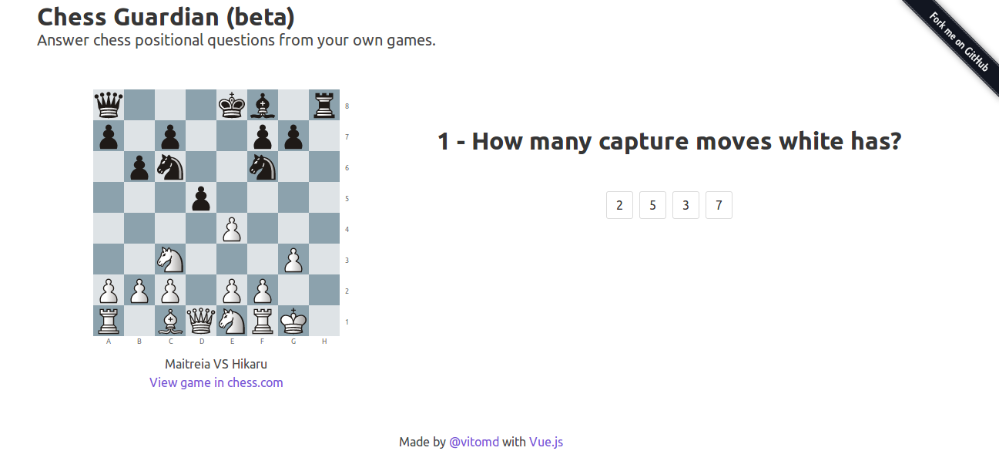

# Chess Guardian

## Answer Chess positional questions from your own games
- Made in [Vue.js](http://vuejs.org) with [Buefy](https://buefy.github.io) for style
- It uses [vue-chessboard](https://github.com/vitogit/vue-chessboard) to show the chessboard and the threats
  - It uses [chess.js](https://github.com/jhlywa/chess.js) for chess movements and validations
  - It uses chessground for chessboard UI  [chessground](https://github.com/ornicar/chessground)
- It uses [chess.com](http://chess.com) API to get positions from your games or specific users



## Try it

[http://vitomd.com/vue-chess-guardian/](http://vitomd.com/vue-chess-guardian/)

## Build Setup

``` bash
# install dependencies
npm install

# serve with hot reload at localhost:8080
npm run dev

```
